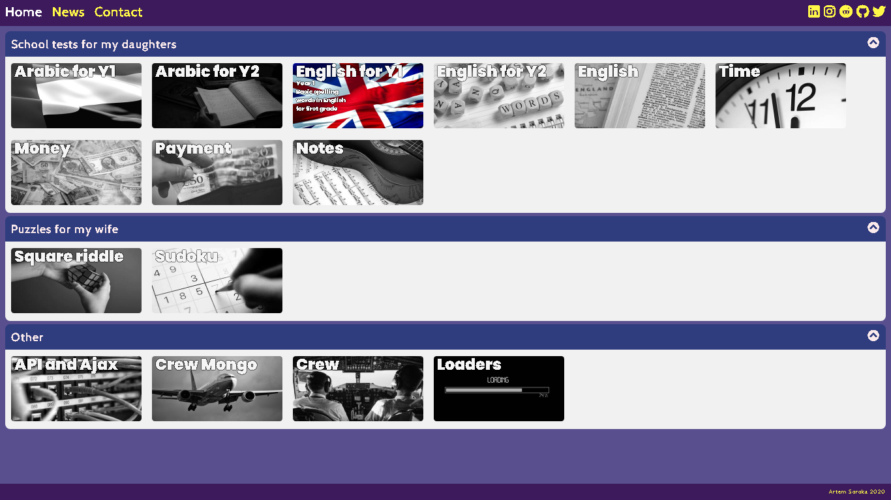
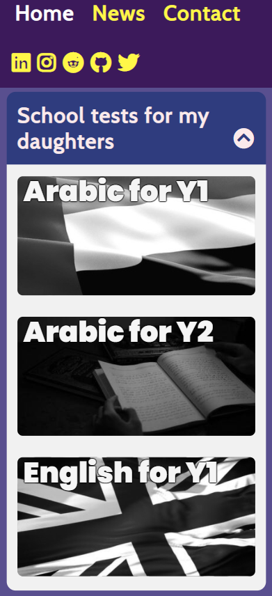

# My web site

My personal web-site for showcase of skills. I wrote it before I learnt JS frameworks, so not all features implemented (like links without document reload). However, I made effort to make it adaptive. Buttons are quite large so my family can comfortably use touch screen from mobile devices.

It is easily scalable since html is generated by JS script and all data stored in JS objects.

I cut the pages folder from this repository since it's duplicating other projects on my github profile. If want to see the code, kindly search [here](https://github.com/nevtemu?tab=repositories "My repositories").   

Using htaccess for pretty urls (short address).
      
This is how it looks like:     
   

     
I created rules to make look better on small screens as well       
 
        
In design I experemented with foldable blocks and on hover effects (text opacity and picture grayscale).    
Used this cool fonts and styles:
- [FontAwesome](https://fontawesome.com/ "FontAwesome")  
- [Poppins Google font](https://fonts.google.com/specimen/Poppins "Poppins font")         
- [Cabin Google font](https://fonts.google.com/specimen/Cabin "Cabin font")            

### Test it yourself
Live version can be found [here](http://artem-soroka.tk/ "My website").   
     
Thank you.